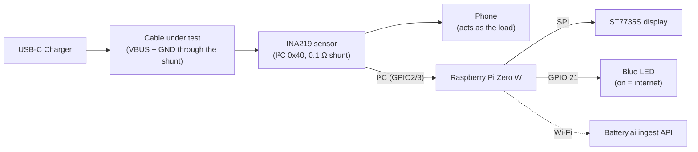
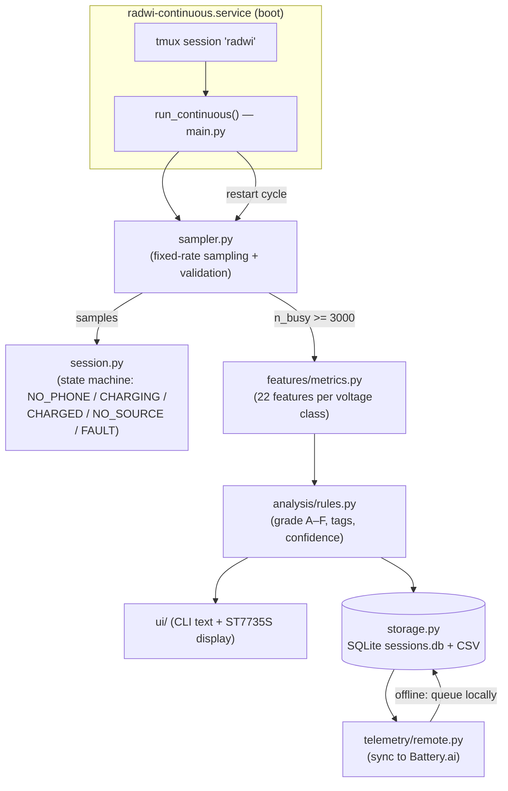
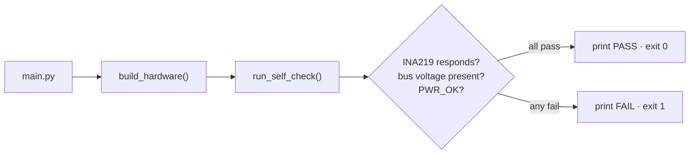
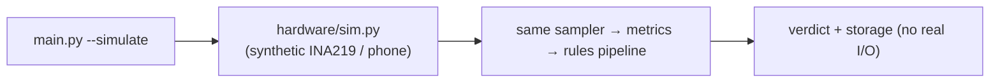
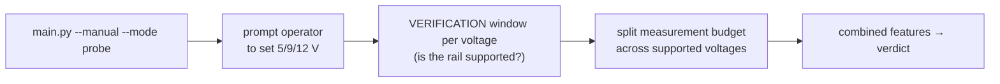
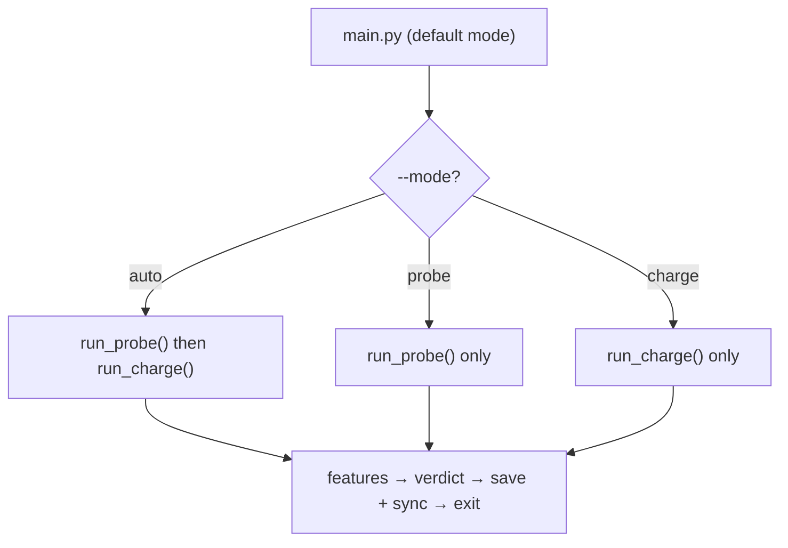
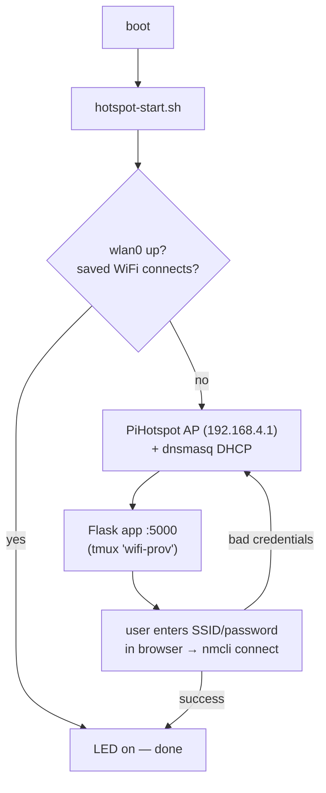

# Cable-Analyzer — Architecture at a Glance

Minimal, abstract reference. One hardware diagram + one diagram per run mode.
For deep detail see `workflow.md`, `Features-plain.md`, and `dependencies.md`.

---

## 1. Hardware Architecture (current `--voltage` build)

The charger, the cable under test, the measurement board, and the phone form
one series power path; the Pi reads the sensor and drives the display/LED.

**Key points**
- CH224K / e-load hardware is **removed**: the charger's own voltage is used
  directly, and the phone's natural charging current is the load.
- Samples are bucketed into real-time **voltage classes** (1 V wide), so a
  charger switching 5 V → 9 V → 12 V simply fills different classes.
- Only the INA219 (I²C), the display (SPI), and one LED (GPIO 21) touch the Pi.

---

## 2. Software Architecture — production mode (`--voltage --continuous`)

The mode the boot service runs. Loop forever: sample → grade → store → sync.

**Cycle:** ~3,000 busy readings (~2 min @ 25 Hz) → verdict → save → sync → repeat.

---

## 3. Other Run Modes

### 3.1 `--self-check`
Hardware sanity check only, exits with code 0/1.

### 3.2 `--simulate` (and `--demo`)
Synthetic hardware replaces real sensors; the whole pipeline runs on a PC.

### 3.3 `--manual`
CH224K still attached but GPIO-unwired: operator changes voltages by hand.

### 3.4 Default `--mode auto` / `probe` / `charge`
One-shot session (probe, then charge monitoring), then exit.

### 3.5 WiFi provisioning service (`wifi-provision.service`)
Independent boot service that guarantees the Pi always has connectivity.

