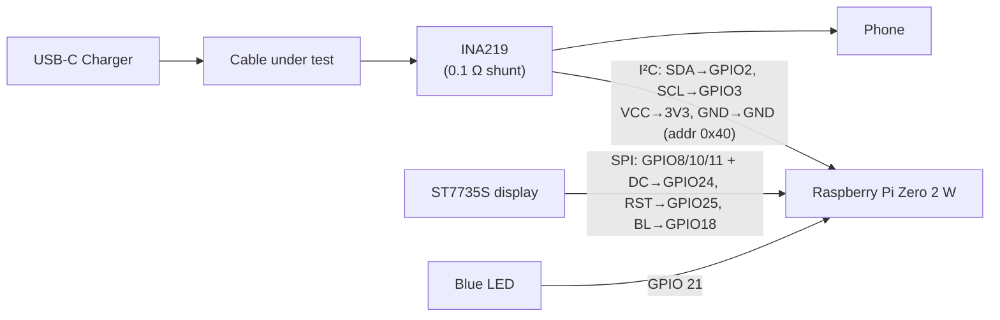

# Hardware Usage — `hardware-usage.md`

Abstract overview of the hardware in the current `--voltage --continuous`
build and how the pieces connect. For OS packages, the venv, services, and
hotspot setup, see **`dependencies.md`** — this file only covers the hardware.

---

## Components

| Component | Role |
|---|---|
| **Raspberry Pi Zero 2 W** | The brain: samples the sensor, runs the grading loop, drives the display and LED, syncs to the cloud |
| **INA219** | Inline power sensor — measures the bus voltage and charging current through a 0.1 Ω shunt |
| **ST7735S TFT display** (128×160, SPI) | Shows live voltage/current, state, SSID, and the latest verdict |
| **Blue LED** | On = internet connected (controlled by the wifi-provision scripts) |
| **USB-C charger + phone** | The charger supplies power directly; the phone is the load — no PD trigger hardware is used |

## How they connect



**Wiring essentials**

- **INA219** sits inline in the USB-C power path; the Pi reads it over I²C bus 1
  at address `0x40` (A0/A1 strapped to GND). Common ground everywhere.
- **Display** uses hardware SPI (`spidev0.0`, CE0 = GPIO 8) plus DC/RST/BL GPIOs.
- **LED** is a single GPIO output on GPIO 21 (physical pin 40).
- The charger's own voltage is used as-is; readings are bucketed into real-time
  1 V voltage classes, so no voltage-selection hardware exists in this build.

## Verify the hardware

```bash
i2cdetect -y 1                            # must show 40 (INA219)
ls /dev/spidev0.0 /dev/i2c-1              # buses enabled
python -m src.main --voltage --self-check # full sanity check
```

## Setup

Everything OS/software related — apt packages, venv, `.env`, service files,
first-time hotspot commands — is in **[`dependencies.md`](dependencies.md)**.
