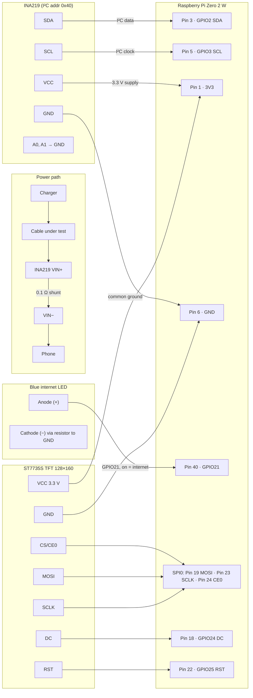

# Wiring — `wiring.md`

How the hardware is wired in the current `--voltage --continuous` build.
No CH224K, no PD-trigger GPIOs, no switches or e-load — the charger's own
voltage powers the phone directly, and the INA219 measures what flows.

## Power path (inline measurement)

```
Charger ──► Cable under test ──► INA219 VIN+ ──[0.1 Ω shunt]── VIN− ──► Phone
```

- The shunt sits in the **VBUS line** (high-side sensing); GND stays common.
- Raw INA219 current reads negative with this direction
  (`current_direction = "reverse"` in `config.toml` corrects it).
- With source VBUS on VIN− and phone on VIN+, `voltage()` reads source-side
  (`bus_voltage_side = "source"`).

## Signal wiring (mermaid)



## Raspberry Pi Zero 2 W — GPIO map (current build)

| Function | GPIO (BCM) | Header pin | Direction | Notes |
|---|---|---|---|---|
| I²C SDA | GPIO2 | 3 | in/out | INA219 SDA |
| I²C SCL | GPIO3 | 5 | in/out | INA219 SCL |
| 3V3 | — | 1 (or 17) | out | INA219 VCC, display VCC |
| 5V | — | 2 (or 4) | in | Pi power |
| GND | — | 6 (or 9, 14, 20…) | — | common ground |
| SPI MOSI | GPIO10 | 19 | out | display data |
| SPI SCLK | GPIO11 | 23 | out | display clock |
| SPI CE0 | GPIO8 | 24 | out | display chip select |
| Display DC | GPIO24 | 18 | out | data/command |
| Display RST | GPIO25 | 22 | out | display reset |
| Internet LED | GPIO21 | 40 | out | blue LED; ON = internet |

> **Backlight** is hard-wired to 3.3 V on this build (no GPIO control).
> **Unused legacy GPIOs** (GPIO5, 6, 17–18, 22–23, 26–27) belong to the
> removed CH224K/e-load hardware and stay unconnected.
